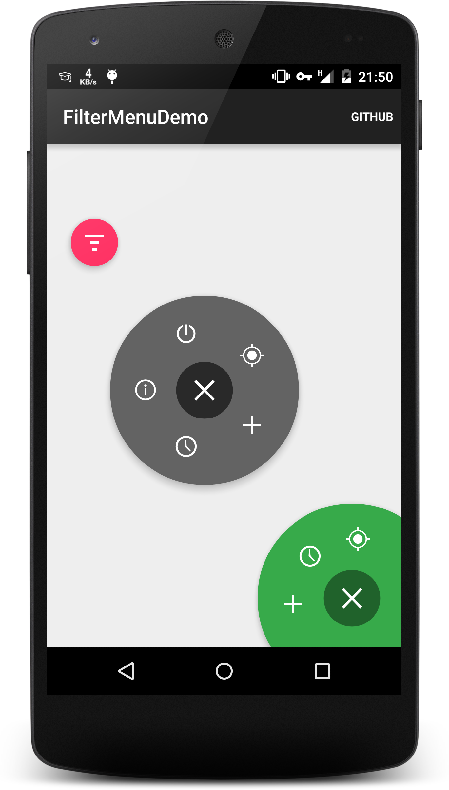

# FilterMenu

[](http://search.maven.org/#search%7Cga%7C1%7Ccom.linroid.filtermenu)

This is a library project with a custom view that implements  concept of  Filter Menu(https://dribbble.com/shots/1956586-Filter-Menu) made by  Anton Aheichanka for android

## Quick Overview
 - Download sample [Apk](https://github.com/linroid/FilterMenu/blob/master/sample/sample-release.apk?raw=true)
 
 - Screenshots
 
    
 - Youtube Video
 
     [](http://www.youtube.com/watch?v=HClK9Ams6gM)
     
## Futures
 - Detect edge automatically
 - Support for android menu resource
 
## Getting Started
 - Download the source to use it as library project, or grab via Maven
 - 
 ```xml
 <dependency>
   <groupId>com.linroid.filtermenu</groupId>
   <artifactId>library</artifactId>
   <version>{last-version}</version>
   <type>aar</type>
 </dependency>
 ```
 or Gradle
 
 ```
 compile 'com.linroid.filtermenu:library:0.2.+@aar'
 ```
 - Declare FilterMenuLayout inside your layout
 
    ```xml
    <com.linroid.filtermenu.library.FilterMenuLayout
        android:id="@+id/filter_menu"
        android:layout_width="match_parent"
        android:layout_height="match_parent"
        android:elevation="8dp"
        custom:fm_expandedRadius="96dp"
        custom:fm_collapsedRadius="24dp"
        custom:fm_centerBottom="50dp"
        custom:fm_centerRight="50dp"
        custom:fm_primaryColor="#ff37aa4a"
        custom:fm_primaryDarkColor="#ff20622b">
    </com.linroid.filtermenu.library.FilterMenuLayout>
    
    
    <!--circle radius size when menu expanded-->
    custom:fm_expandedRadius
    <!--circle radius size when menu collapsed-->
    custom:fm_collapsedRadius
    <!--set the position of circle, the menu will auto align.
        You should only set two directions at most.-->
    custom:fm_center[Left|Top|Right|Bottom]
    <!-- If true, centers the circle horizontally.-->
    custom:fm_centerHorizontal
    <!-- If true, centers the circle vertically.-->
    custom:fm_centerVertical
    <!--primary color-->
    custom:fm_primaryColor
    <!--color of inner circle when menu expanded-->
    custom:fm_primaryDarkColor
    ```
 - Initial menu items via java code
 
    ```java
    FilterMenuLayout layout = (FilterMenuLayout) findViewById(R.id.filter_menu);
    FilterMenu menu = new FilterMenu.Builder(this)
        .addItem(R.drawable....)
        //.inflate(R.menu....)//inflate  menu resource
        .attach(layout)
        .withListener(new FilterMenu.OnMenuChangeListener() {
            @Override
            public void onMenuItemClick(View view, int position) {
            }
            @Override
            public void onMenuCollapse() {
            }
            @Override
            public void onMenuExpand() {
            }
        })
        .build();
    ```
    
## ChangeLog
 - 0.2.0
    - support for android menu resource
    - support for centerHorizontal and centerVertical attribute

## License
Copyright 2015 linroid

Licensed under the Apache License, Version 2.0 (the "License");
you may not use this file except in compliance with the License.
You may obtain a copy of the License at

    http://www.apache.org/licenses/LICENSE-2.0

Unless required by applicable law or agreed to in writing, software
distributed under the License is distributed on an "AS IS" BASIS,
WITHOUT WARRANTIES OR CONDITIONS OF ANY KIND, either express or implied.
See the License for the specific language governing permissions and
limitations under the License.
